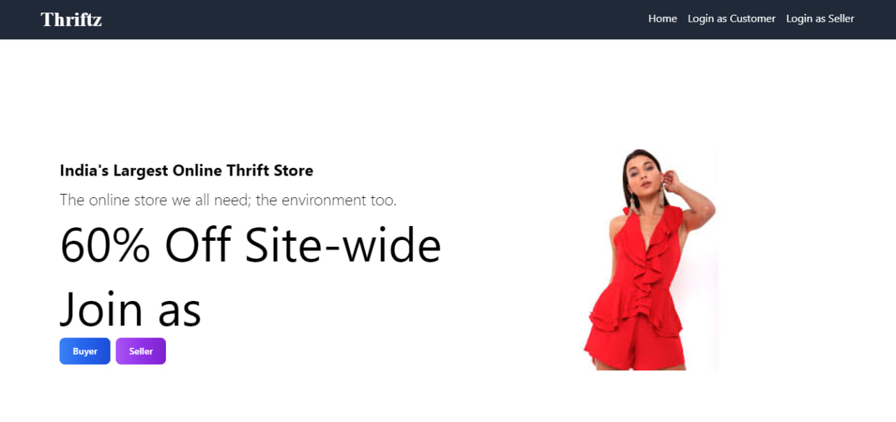

# Thrift Store NextJS Website Project

## Tagline

"The online store we all need; the environment too."

## Description

Welcome to our NextJS thrift store website! In a world of fast fashion and throwaway mentality, we offer an economical and environmentally friendly alternative to buying new things. Our platform encourages sustainability by promoting the reuse of clothing and other items.

## Features

1. **Unique Try-On Feature**: Want to see how a piece of clothing looks on you before making a purchase? Our unique try-on feature allows you to virtually try on clothes to ensure the perfect fit and style.

2. **Amazing Return Policy**: We value customer satisfaction. If you receive any damaged articles, you have 24 hours to return them with valid proof, and we will take care of the rest.

3. **Secure Payment Gateway**: Your security is our top priority. We offer a secure payment gateway integrated with Polygon, ensuring smooth and safe transactions.

4. **Minimal Selling Fee**: Are you a seller looking to reach a wide audience? We've got you covered! Sell your products on our platform with just a minimal selling fee that is automatically adjusted to suit your needs.

## Demo Video

## Technologies Used

- NextJS
- Tailwind CSS

## Getting Started

To run this project locally, follow these steps:

1. Clone the repository: `git clone https://github.com/VanshWadhwa/thrift-store.git`
2. Navigate to the project folder: `cd thrift-store`
3. Install dependencies: `npm install`
4. Start the development server: `npm run dev`
5. Open your browser and go to `http://localhost:3000`

## Contributing

We welcome contributions to improve the thrift store website. If you find any issues or have suggestions, feel free to open a pull request or raise an issue.

